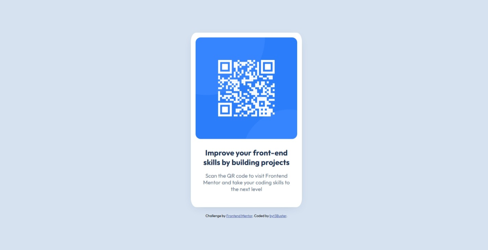

# Frontend Mentor - QR code component solution

This is a solution to the [QR code component challenge on Frontend Mentor](https://www.frontendmentor.io/challenges/qr-code-component-iux_sIO_H). Frontend Mentor challenges help you improve your coding skills by building realistic projects. 

## Table of contents

- [Overview](#overview)
  - [Screenshot](#screenshot)
  - [Links](#links)
- [My process](#my-process)
  - [Built with](#built-with)
  - [What I learned](#what-i-learned)
  - [Continued development](#continued-development)
  - [Useful resources](#useful-resources)
- [Author](#author)
- [Acknowledgments](#acknowledgments)

## Overview

### Screenshot

### Links

- Solution URL: [Add solution URL here](https://your-solution-url.com)
- Live Site URL: [Add live site URL here](https://your-live-site-url.com)

## My process

### Built with

- Semantic HTML5 markup
- CSS custom properties
- Flexbox

### What I learned
I learned how the div behave when using CSS properties: display, flex-direction, justify-content, align-items, etc.. I also learned to better understand the margin and padding of an element. It was a very good experience for me. Thanks you Front End Mentor 😊.

### Continued development

I think i would learn more with my future projets.

### Useful resources

- [Example resource 1](https://www.frontendmentor.io/solutions/qr-component-using-basic-html-and-css-FmBeYjwRzG) - This helped me for understand what projet about.

## Author

- Frontend Mentor - [@byt3Buster](https://www.frontendmentor.io/profile/byt3Buster)

## Acknowledgments
[obkpakpa](https://www.frontendmentor.io/profile/obkpakpa) help me wich his solution. Thanks to him.
